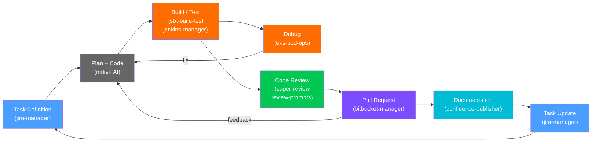

# DotSkills

**Production-grade Agent Skills that close the developer loop — from Jira ticket to merged PR.**

A curated collection of 14 self-contained skills following the [Agent Skills Open Standard](https://agentskills.io/specification).
Works with **Claude Code**, **Windsurf**, **Cursor**, **Codex**, **Gemini CLI**, and [40+ other IDEs](https://skills.sh/).

## Quick Start

**With Node.js** (recommended — supports [42 IDEs](https://skills.sh/) automatically):

```bash
# Install all skills
npx skills add sagy101/DotSkills

# Install specific skills
npx skills add sagy101/DotSkills --skill jira-manager --skill eks-pod-ops

# Install globally (user-level, available in all projects)
npx skills add sagy101/DotSkills -g
```

**Without Node.js** (auto-detects installed IDEs, copies skills):

```bash
curl -fsSL https://raw.githubusercontent.com/sagy101/DotSkills/main/install.sh | bash

# Install specific skills only
curl -fsSL https://raw.githubusercontent.com/sagy101/DotSkills/main/install.sh | bash -s -- --skill jira-manager

# Install globally (user-level)
curl -fsSL https://raw.githubusercontent.com/sagy101/DotSkills/main/install.sh | bash -s -- --global
```

**Manual** (copy to any IDE's skills directory):

```bash
git clone --depth 1 https://github.com/sagy101/DotSkills.git /tmp/dotskills
cp -r /tmp/dotskills/<skill-name> ~/.claude/skills/   # or your IDE's skills path
rm -rf /tmp/dotskills
```

## The Developer Loop

Every skill maps to a stage in the developer workflow. The goal: an AI agent that can assist across the entire loop without ever touching secrets or making irreversible changes without approval.



## Why DotSkills

**AI agents are great at writing code but bad at integration.** Without guardrails, they write ad-hoc curl commands, miss pagination, hardcode credentials, and skip safety checks on destructive operations.

**Each skill wraps one external system with deterministic CLI scripts.** Scripts absorb the complexity — they handle pagination, retries, error formatting, and output parsing. The agent makes simple, sequential calls. Every additional agent step is a place to fall; every script is a place to land.

**Security is not an afterthought.** Credentials are never stored in config files (only env var *names*). All output passes through secret redaction pipelines. Dangerous commands are blocklisted before execution. Write operations default to dry-run. Destructive actions require explicit user approval. PR approval is intentionally omitted — that is a human-only action.

**Zero or minimal dependencies.** Most skills are pure Python stdlib with no pip install, no venv setup, and no build step. A skill works the moment it is copied into your IDE's skill directory.

## Skills by Stage

### Task Definition

| Skill | What It Does | Links |
|---|---|---|
| [jira-manager](./jira-manager/) | CRUD, bulk ops, JQL, field discovery, transitions | [design](./docs/jira-manager/jira-manager-design.md) |

### Code

| Skill | What It Does | Links |
|---|---|---|
| [codex-subagent](./codex-subagent/) | Delegate tasks to OpenAI Codex CLI — parallel work, fresh context, safety wrapper | [design](./docs/codex-subagent/codex-subagent-design.md) |

### Build / Test

| Skill | What It Does | Links |
|---|---|---|
| [sbt-build-test](./sbt-build-test/) | Multi-repo builds, dependency chains, test parsing | [design](./docs/sbt-build-test/sbt-build-test-design.md) |

### CI/CD

| Skill | What It Does | Links |
|---|---|---|
| [jenkins-manager](./jenkins-manager/) | Build status, logs, triggers, auto-discovery from git | [design](./docs/jenkins-manager/jenkins-manager-design.md) |

### Debug

| Skill | What It Does | Links |
|---|---|---|
| [eks-pod-ops](./eks-pod-ops/) | Pod logs, exec, restarts, secret redaction | [design](./docs/eks-pod-ops/eks-pod-ops-design.md) |

### Code Review

| Skill | What It Does | Links |
|---|---|---|
| [super-review](./super-review/) | Parallel multi-perspective reviews, graded reports | [design](./docs/super-review/super-review-design.md) |
| [review-prompts](./review-prompts/) | 12 review prompt types, standalone or file injection | |

### Pull Request

| Skill | What It Does | Links |
|---|---|---|
| [bitbucket-manager](./bitbucket-manager/) | PR lifecycle, comments, build checks, Jira extraction | [design](./docs/bitbucket-manager/bitbucket-manager-design.md) |

### Documentation

| Skill | What It Does | Links |
|---|---|---|
| [confluence-publisher](./confluence-publisher/) | Markdown to Confluence, hierarchies, Mermaid, surgical edits | [design](./docs/confluence-publisher/confluence-publisher-design.md) |

### Meta / Tooling

| Skill | What It Does |
|---|---|
| [skill-creator](./skill-creator/) | Scaffold new skills from scripts or from scratch, spec compliance verification |
| [codebase-analyzer](./codebase-analyzer/) | Line counts, language breakdown, test ratios, git churn hotspots |

## Security Principles

- **Credentials via env var names only** — config stores `"token_env": "JIRA_TOKEN"`, never the token itself
- **Automatic secret redaction** — all output passes through regex pipelines (Bearer tokens, AWS keys, JWTs, passwords, high-entropy strings)
- **Exec blocklist** — dangerous commands (`env`, `printenv`, secret file reads) blocked before execution
- **Dry-run by default** — write operations support `--dry-run`; agents preview before acting
- **Approval gates** — destructive operations (merge, decline, delete) require explicit user confirmation
- **No rubber-stamping** — PR approval intentionally omitted; approval is a human-only action
- **Log scrubbing** — Jenkins and EKS log output is redacted before reaching the agent context

## Auto-Approval of Read Commands

Read-only skill commands (fetching data, listing resources, checking status) can be
auto-approved to reduce prompt fatigue during agent sessions.

- **Claude Code**: Add a `PreToolUse` hook referencing the patterns in
  [`.claude/hooks/read-commands.json`](.claude/hooks/read-commands.json).
  See the [Claude Code hooks documentation](https://docs.anthropic.com/en/docs/claude-code/hooks)
  for setup instructions.
- **Windsurf**: Add command prefixes from the
  [read command whitelist](docs/read-command-whitelist.md) to your
  `settings.json` allowed commands.
- **Other IDEs**: Add patterns from the
  [read command whitelist](docs/read-command-whitelist.md) to your IDE's
  allowed-commands configuration.

## Compatibility

Skills follow the [Agent Skills Open Standard](https://agentskills.io/specification).
`npx skills add` supports [42 IDEs and AI tools](https://skills.sh/). Popular targets include:

- **Claude Code** (`.claude/skills/`)
- **Windsurf** (`.windsurf/skills/`)
- **Cursor** (`.cursor/skills/`)
- **OpenAI Codex** (`.codex/skills/`)
- **Gemini CLI** (`.gemini/skills/`)
- **Junie / JetBrains** (`.junie/skills/`)
- **GitHub Copilot**, **Roo Code**, **Cline**, and many more

## Structure

Each skill follows this layout:

```
skill-name/
  SKILL.md              # Required — skill definition (YAML frontmatter + instructions)
  scripts/              # Optional — executable scripts
  references/           # Optional — detailed docs, schemas, templates
  assets/               # Optional — images, data files, templates
```

Design documents for each skill live in [`docs/`](./docs/).

## Tests

820+ tests across the repo, organized by skill in `tests/`:

```
tests/
  codex-subagent/        # 83 tests — safety parsing, flag scanning, arg building
  eks-pod-ops/           # 64 tests — secret redaction, config loading, pod parsing
  jenkins-manager/       # 83 tests — config, redaction, client, status, ANSI stripping
  jira-manager/          # 70+ tests — config, field resolution, JQL, links, workflows
  sbt-build-test/        # 30 tests — workspace graph, topo sort, dependency graph
  confluence-publisher/  # page utils, element replacement
  bitbucket-manager/     # E2E integration tests
```

```bash
python3 -m pytest tests/ -v
```

## Roadmap

- **Team notification skill** — Slack/Teams integration to notify developers on build results, PR status, and ticket transitions. Exploring [Vercel AI Chat SDK](https://sdk.vercel.ai/) as the foundation.

## Adding a New Skill

Use the skill-creator's init script to scaffold a new skill:

```bash
python3 skill-creator/scripts/init_skill.py my-new-skill --path .
```

Or manually:

1. Create a directory named after your skill (lowercase, hyphens only)
2. Add a `SKILL.md` with YAML frontmatter (`name`, `description`) and body instructions
3. Add scripts/references/assets as needed
4. Validate with `python3 skill-creator/scripts/quick_validate.py ./my-new-skill/`
5. Update the table in this README

## License

[MIT License](./LICENSE) — free to use, modify, and redistribute. Attribution required (keep the copyright notice).
