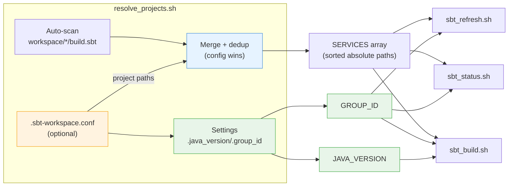
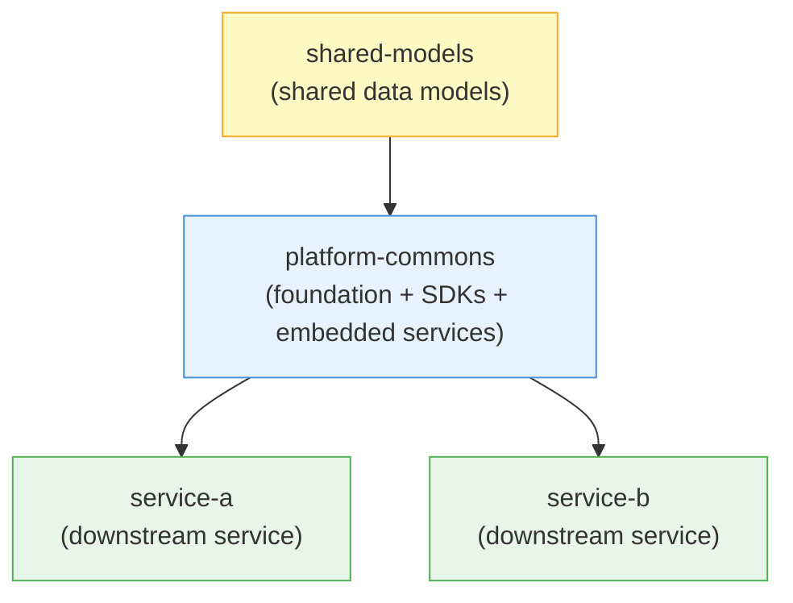
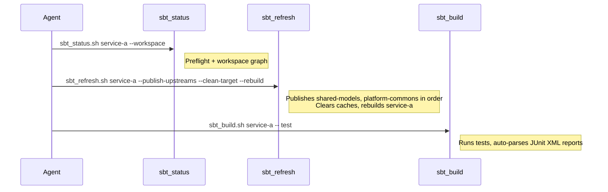
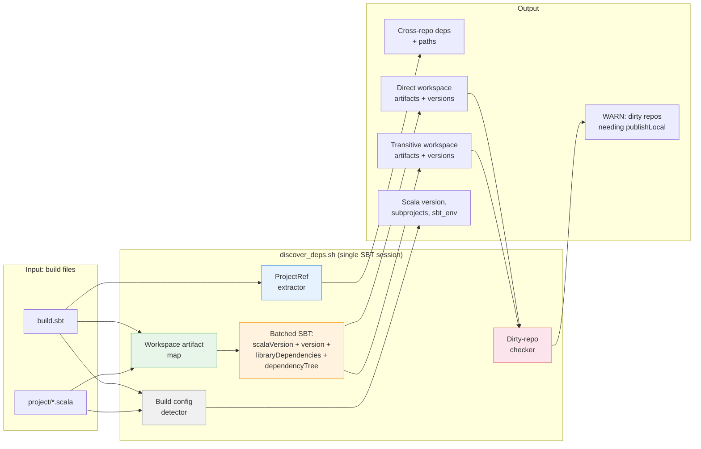

# SBT Multi-Repo Build & Test Skill

An AI agent skill for building, testing, collecting scoped scoverage reports, publishing, and diagnosing Scala/SBT services in a multi-repo workspace. Provides four agent-facing commands that wrap internal plumbing for log-first execution, workspace dependency management, JUnit XML test parsing, and remote-cache-safe coverage runs.

## Agent-Facing Commands

| Command | Script | Description |
|---|---|---|
| **Build** | `sbt_build.sh` | Compile, test, collect scoped coverage, or publishLocal with automatic preflight, dep-checking, log capture, auto-publish of missing deps, and test report parsing |
| **Status** | `sbt_status.sh` | Discover project dependencies, inspect workspace state, plan cross-repo changes, or verify artifact resolution |
| **Refresh** | `sbt_refresh.sh` | Publish upstream dependencies in order, clear stale caches, and rebuild |
| **Reset** | `sbt_reset.sh` | Wipe the isolated build cache and return to clean remote-only resolution |

## Internal Scripts

These scripts are implementation details — the agent calls the three commands above, which delegate to these internally.

| Script | Purpose |
|---|---|
| `run_sbt_capture.sh` | Runs SBT with log capture, error summary extraction, workspace dep pre-check, and forwarding for `--coverage` / `--no-remote-cache` |
| `run_sbt.sh` | Low-level SBT wrapper: Java resolution, isolated cache flags, `sbt_env` forwarding, test-run locking, stale lock auto-clearing, `--batch` mode, remote-cache bypass, and scoped scoverage wrapping |
| `check_workspace_deps.sh` | Pre-checks that workspace `ProjectRef` dependencies are published in the isolated cache |
| `preflight_check.sh` | Validates Java, python3, credentials, isolated cache, branch alignment, stale publishes, resolver risks |
| `discover_deps.sh` | Scans a single repo for ProjectRef deps, workspace artifact deps (direct + transitive), dirty-repo warnings, build config |
| `discover_workspace.sh` | Maps direct workspace dependencies and computes topological publish order |
| `plan_change.sh` | Shows upstreams, downstreams, impact on a target repo, and suggested commands |
| `publish_chain.sh` | Publishes selected repos and their upstream deps in dependency order |
| `refresh_downstream.sh` | Removes isolated-cache and Coursier entries, optionally clears `target/`, and can rebuild |
| `verify_local_resolution.sh` | Shows classpath matches, resolution source, local publish candidates, and guidance |
| `parse_test_reports.sh` | Parses JUnit XML reports into pass/fail summaries with failure details; cross-references SBT log to detect crashed suites |
| `common.sh` | Shared utilities: Java resolution, cache paths, log file naming, test locks, artifact name/version extraction, build file collection |
| `resolve_projects.sh` | Sourced helper: builds the `SERVICES` array from workspace auto-scan + `.sbt-workspace.conf` |
| `workspace_graph.py` | Python helper: builds workspace dependency graph JSON with topological sort |

## Workspace Assumptions & Project Locations

By default, scripts assume all SBT repos are **direct children of a single workspace directory**. Example layout:

```
workspace/
  .sbt-workspace.conf    # optional — override project locations
  shared-models/         # leaf library
  platform-commons/      # middle-tier
  service-a/             # downstream service
  service-b/             # downstream service
  ...
```

`ProjectRef` paths in `build.sbt` are expected to use `../sibling-name` notation (e.g., `ProjectRef(file("../shared-models"), "shared-models")`).

### Overriding defaults (`.sbt-workspace.conf`)

Create a `.sbt-workspace.conf` file in the workspace root to override Java version, project locations, and/or the workspace artifact group:

```bash
# <workspace>/.sbt-workspace.conf

# Settings (keys start with a dot):
.java_version=17       # default — change for non-Java 17 projects
.group_id=com.acme             # optional — otherwise inferred from organization := when possible

# Project path overrides (auto-discovered projects are still included):
# Format: project-name=/absolute/path/to/project
# Config entries override auto-discovered paths for the same project name.
shared-models=/some/other/path/shared-models
platform-commons=/another/place/platform-commons
```

All workspace-level scripts read this file automatically via a shared helper (`resolve_projects.sh`). The resolution order is:

1. **Auto-scan** — find all `*/build.sbt` under the workspace directory
2. **Settings** — apply `.java_version` and `.group_id` if present
3. **Group auto-detection** — infer `GROUP_ID` from local `organization :=` settings if `.group_id` is absent
4. **Config merge** — add or override project entries (config wins on name collision)
5. **Deduplicate and sort** — produce a final `SERVICES` array sorted by project name



### Workflow

1. `sbt_status.sh <project-dir>` — understand the dependency state
2. `sbt_build.sh <project-dir> -- compile` — build with automatic preflight and dep-checking
3. `sbt_refresh.sh <project-dir> --publish-upstreams --rebuild` — when upstream changes need propagating

### Coverage Mode

Coverage runs are exposed through `sbt_build.sh --coverage -- "<scoped command>"`.

The implementation intentionally keeps the user command as its own SBT argument and injects setup/teardown commands around it in the same SBT session:

1. Recursively remove local `target/scala-*` directories before startup.
2. Disable `maybePullRemoteCache` for the scoped project (or `every` scope when no project is given), which prevents CAP-style remote cache hooks from restoring uninstrumented classes.
3. Run scoped `clean`, then `coverage`.
4. Force `Test / fork := false` so scoverage writes measurements in-process.
5. Execute the original user command unchanged.
6. Run scoped `coverageReport`.

This design was verified against CAP `cap-commons` using:

```bash
bash sbt-build-test/scripts/sbt_build.sh /Users/sashlag/cap-projects/cap-commons \
  --workspace-dir /Users/sashlag/cap-projects \
  --coverage -- \
  "aws / testOnly com.proofpoint.casb.cap.sdk.aws.test.unittests.paginator.AwsUserPaginationTest"
```

That run executed 4 tests successfully and produced non-zero AWS coverage (`3.93%` statement, `3.03%` branch), which confirms both the remote-cache bypass and report generation paths.

### Example Dependency Graph

Example: a multi-repo workspace contains several SBT repos with cross-repo dependencies:



In this example, artifacts flow **top-down**: publish `shared-models` first, then `platform-commons`, then downstream services.

### Example: Cross-Repo Change Flow



## How Dynamic Discovery Works

Dependency discovery uses a **hybrid model**: static parsing for `ProjectRef` and workspace topology, plus SBT-evaluated output for direct dependencies and build metadata. All evaluated data (`show scalaVersion`, `show version`, `show libraryDependencies`, `Compile/dependencyTree`) is collected in a **single batched SBT invocation** to minimize startup overhead.



### Discovery techniques

**1. Cross-repo source dependencies (`ProjectRef`)**

Greps `build.sbt` for `ProjectRef(file("..."), "name")` declarations and extracts the relative path and project name. These represent dev-mode source dependencies that point to sibling repos.

**2. Workspace artifact map**

Scans every workspace repo's `build.sbt` and `project/*.scala` for `name := "artifact-name"` settings. This produces an exact local artifact inventory used to filter both direct and transitive dependency output.

**3. Published artifact dependencies**

From the batched SBT output: filters `show libraryDependencies` to `GROUP_ID`-matching artifacts, intersects with the workspace artifact map.

**4. Transitive dependencies**

From the batched SBT output: filters `Compile/dependencyTree` to `GROUP_ID`-matching artifacts, removes evicted entries, intersects with the workspace artifact map, skips direct deps already shown.

**5. Dirty-repo cross-reference**

Combines direct and transitive artifact lists, checks each workspace repo with uncommitted changes against required artifacts. Warnings are tied to the actual producing repo via the workspace artifact map.

**6. Build configuration**

- **`sbt_env` support**: checks if `build.sbt` contains `System.getProperty("sbt_env")`
- **Scala version**: prefers SBT-evaluated output, with static fallback
- **Artifact version**: prefers SBT-evaluated output, with static fallback
- **Multi-project detection**: matches `lazy val <name> = (project|Project(` patterns

### Workspace-level discovery

`discover_workspace.sh` and `preflight_check.sh` both source `resolve_projects.sh` to build the project list. `discover_workspace.sh` combines detected `ProjectRef` links with statically detected workspace artifact dependencies and computes a **direct workspace dependency graph** plus a **direct-dependency topological order**.

## Key Design Decisions

1. **Three-command agent interface** — `sbt_build.sh`, `sbt_status.sh`, and `sbt_refresh.sh` wrap internal scripts to reduce cognitive load for the agent while preserving full functionality.
2. **Fully isolated caches** — `~/.sbt-build-cache/` isolates Ivy home, Coursier cache, SBT boot, and SBT global base via `-D` system properties. Normal `sbt` is never contaminated, and parallel worktree builds are safe when each worktree uses a separate `SBT_BUILD_CACHE_ROOT`.
3. **Batched SBT evaluation** — `discover_deps.sh` runs all four SBT show/tree commands in a single session to avoid repeated startup overhead.
4. **Hybrid discovery** — `ProjectRef` and workspace topology stay in shell/grep, while SBT provides authoritative evaluated dependency and version data.
5. **Workspace artifact filtering** — both direct and transitive results are intersected with artifacts produced by local workspace repos.
6. **Auto-test-report parsing** — `sbt_build.sh` detects test commands and automatically parses JUnit XML reports after the run.
7. **Auto-publish missing deps** — `sbt_build.sh --auto-publish-deps` handles the common case of missing upstream artifacts without manual intervention.
8. **Shared SBT execution wrappers** — `run_sbt.sh` centralizes Java resolution, isolated-cache flags, `sbt_env` forwarding, and test-run locking. `run_sbt_capture.sh` adds persistent logs and concise error summaries.
9. **Python XML parsing** — JUnit XML parsing uses `xml.etree.ElementTree` for robust failure extraction.
10. **Repo-level workspace ordering** — `discover_workspace.sh` computes a real direct-dependency topological order for repos, but does not claim a full artifact-level DAG.
11. **Flexible project locations** — the default assumes all repos under one workspace dir, Java defaults to `17`, and the workspace group is inferred when possible. `.sbt-workspace.conf` can override any of these.
12. **Workspace dependency pre-check** — `run_sbt_capture.sh` runs `check_workspace_deps.sh` before launching SBT to detect missing workspace artifacts. This avoids the slow SBT startup -> resolution failure -> diagnose cycle.
13. **Transitive version resolution** — `publish_chain.sh` searches build files from ALL repos in the chain (not just the target) to resolve the correct version for each upstream. E.g., shared-models' version is found in platform-commons' build files even when the target is service-a.
14. **Cache clearing before re-publish** — `publish_chain.sh` clears stale cached artifacts before each `publishLocal` to avoid Ivy's non-SNAPSHOT overwrite protection.
15. **Stale lock auto-clearing** — `run_sbt.sh` checks lock file PIDs with `kill -0` and treats locks with dead PIDs or locks older than 2 hours as stale, removing them automatically. `sbt_build.sh` also reports stale locks visibly before the build starts.
16. **Batch mode for test commands** — `run_sbt.sh` adds `--batch` for test commands to force a fresh SBT process, avoiding stale incremental state from SBT server reuse. `sbt_build.sh --fresh` explicitly enables this.
17. **SBT log cross-reference for crashed tests** — `parse_test_reports.sh` auto-finds the most recent SBT log file, parses `[error] Failed tests:` entries, and flags any suite listed by SBT but missing from JUnit XML as `CRASHED`. Prevents false "ALL PASSED" verdicts.
18. **Deep subproject test report scanning** — `sbt_build.sh` uses `find -maxdepth 4` to discover test reports in nested multi-project layouts (e.g. `sdks/chatgpt/target/test-reports`), not just one level deep.
19. **SBT server kill on refresh** — `sbt_refresh.sh --kill-server` (auto-triggered with `--clean-target`) shuts down the SBT server process to avoid incremental state carrying over after cache wipes.
20. **Log freshness detection** — `run_sbt_capture.sh` compares log file mtime against invocation start time and warns if the log is from a previous run.
21. **Human-readable exit codes** — `run_sbt_capture.sh` prints exit code meaning: 0=SUCCESS, 1=SBT error, 2=Infrastructure error.
22. **Coverage-safe input task execution** — coverage mode injects setup (`maybePullRemoteCache := None`, `clean`, `coverage`, `Test / fork := false`) and teardown (`coverageReport`) as separate SBT arguments around the original user command, so input tasks such as `testOnly <suite>` still execute normally instead of being swallowed by a semicolon-only wrapper.
